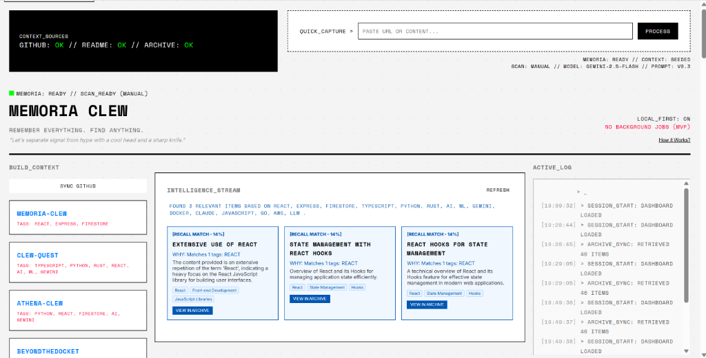
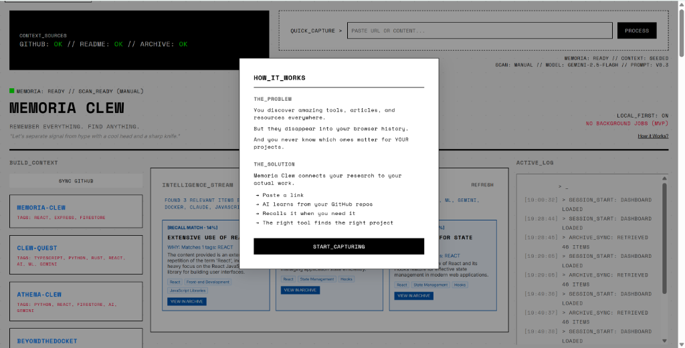
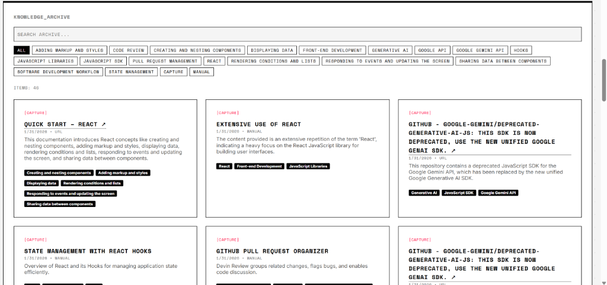

# MEMORIA CLEW

**Remember everything. Find anything.**  
*“Let’s separate signal from hype with a cool head and a sharp knife.”*

---

You save a link while debugging a feature.  
You skim a newsletter while researching a tool.  
You copy a snippet from a thread you *swear* you’ll remember.

In the moment, it matters.

Later, the link is still there — but the reason you saved it is gone.  
The context evaporates.

Bookmarks don’t remember **why**.  
Feeds only show what’s **new**, not what’s relevant **now**.

This isn’t a search problem.  
It’s a **memory + timing** problem.

---

## What Memoria Clew Does

Memoria Clew is a **local-first research memory for developers**.

It captures the external technical information you already consume — **URLs, newsletters, headlines, tools, docs, snippets** — and then **resurfaces** what you saved when it becomes relevant again, with:
- **transparent reasoning**
- **conservative confidence scoring**
- **explicit failure modes** (“no relevant past research found yet”)

No black-box magic. No hidden autonomy. Just useful recall at the right moment.

---



A local-first, memory-augmented research assistant.

Memoria Clew is designed to help you capture, recall, and synthesize information for your projects.



## Knowledge Archive

Explore your captured knowledge with auto-generated tags and smart filters.



---

## Core Workflow (MVP)

1. **Seed context** (optional but powerful)  
   Point Memoria Clew at a GitHub username → it ingests high-level repo context (including READMEs) to establish “what you build.”

2. **Quick Capture**  
   Paste a URL or snippet → Memoria Clew summarizes + tags it → stores it in your archive.

3. **Recall**  
   Ask a question or capture something new → Memoria Clew scores your archive against your current context and returns the best matches, with reasons.

4. **Proactive scan (manual, MVP)**  
   Trigger a single-source scan (e.g., HN RSS) → Memoria Clew produces a small set of context-matched items (top 3) instead of a firehose.

5. **System log**  
   Every meaningful action is logged (capture, tagging, recall triggers, rate limit decisions).

---

## Features (What’s Actually in the Repo)

### ✅ Capture + Archive
- Paste **URL or text snippet**
- LLM **summary + tag extraction**
- Archive persisted via **Firestore** (user-scoped collections)
- Inspectable structured records (title, summary, tags, source, timestamps)

### ✅ Context Seeding (GitHub)
- GitHub context sync endpoint
- Pulls lightweight signals from public repo metadata and READMEs
- Treated as **weak signal** (biasing recall, not pretending to “understand your whole codebase”)

### ✅ Recall Engine (Deterministic + Explainable)
- Transparent scoring (tag overlap, query match, tool/tech match, recency boost)
- Confidence thresholding to reduce noise
- Explanations like: “Matches tags: REACT, TYPESCRIPT”
- Fallback behavior to avoid empty UX

### ✅ Manual “Proactive” Scan (MVP)
- One manual scan of a single source (HN RSS)
- Produces a small set of context-matched items (top 3)
- No background agents, no always-on crawlers

### ✅ Trust & Safety Guardrails
- Rate limiting service + tests
- Security middleware + tests
- Explicit “suggestive not authoritative” posture

### ✅ Docker for Local Dev + Deployment Readiness
- `docker-compose.yml` included (frontend + MCP server)
- `server/Dockerfile` included (containerizable backend)
- `frontend/Dockerfile.dev` included (dev container)

---

## Architecture

Memoria Clew is intentionally inspectable: **simple services, explicit boundaries, deterministic recall**.

```text
┌───────────────────┐
│   Frontend (Vite) │  React UI
│  - capture input  │  - archive/search
│  - context panel  │  - recall cards
│  - system log     │
└─────────┬─────────┘
          │ HTTP
          ▼
┌───────────────────────────┐
│ Server (Node/Express + MCP)│
│                           │
│  /api/context/sync        │── GitHub context + README signals
│  /api/capture             │── summarize + tag
│  /api/recall              │── deterministic scoring + reasons
│                           │
│  LeanMCP HTTP server      │── exposes tool(s) via MCP interface
└─────────────┬─────────────┘
              ▼
     Firestore (user-scoped)
```

---

## LeanMCP Integration 

Memoria Clew includes a real MCP server powered by **`@leanmcp/core`**.

Why: this project is obsessed with *clarity over hype*. A function-first MCP interface keeps “agent actions” explicit, debuggable, and auditable.

### What it does
- Exposes a recall capability as an MCP tool (`memoria_recall`)
- Enables structured tool invocation over HTTP
- Keeps tool inputs/outputs explicit, making it easier to log and reason about behavior

### How it’s used
- The backend boots **REST endpoints** (for the app) and an **MCP server** (for tool invocation).
- The MCP server is configured via `createHTTPServer(...)` and registers tool factories.

### Why it’s in the project
- It creates a clean contract between UI and “agent tools”
- It matches the hackathon’s MCP-focused sponsor track
- It supports Memoria’s core philosophy: **no hidden autonomy**

---

## Quickstart

### Option A: Docker (recommended for “it just runs”)

1) Copy env file and fill it in:
```bash
cp .env.example .env
```

2) Start everything:
```bash
docker compose up --build
```

3) Open:
- Frontend: http://localhost:3000  
- MCP server: http://localhost:3001  

> Note: the backend also starts an internal REST listener on port 3000 inside the server process; in Docker, the MCP port is what’s exposed for tool invocation.

### Option B: Run locally (no Docker)

**Backend**
```bash
cd server
npm install
npm run dev
```

**Frontend**
```bash
cd frontend
npm install
npm run dev
```

Open:
- Frontend: http://localhost:3000

---

## Configuration (No Secrets in Git)

All config is via `.env` (see `.env.example`).

You’ll typically set:
- `GEMINI_API_KEY`
- `GITHUB_TOKEN` (optional but recommended for higher GitHub rate limits)
- Firebase/Firestore values for persistence

⚠️ Never commit real keys. Use `.env` locally and secret managers in deployment.

---

## Testing & QA

Hackathon reality: we ship a working core loop first, then harden.

### What’s in the repo
- **Backend:** Jest tests (coverage enabled)
- **Frontend:** Vitest tests
- GitHub Actions workflows:
  - backend test workflow
  - frontend test workflow

### How to run tests

**Backend**
```bash
cd server
npm test
```

**Frontend**
```bash
cd frontend
npm test
```

### QA posture (honest)
- The “happy path” demo is strong: capture → archive → recall → explain
- Some tests may be red after rapid refactors (common in hackathon land)
- If you’re demoing: rehearse the happy path, avoid untested edge cases

---

## Accessibility (WCAG 2.1 target)

This project is built with an explicit goal of **WCAG 2.1 AA-friendly UI**:
- keyboard-navigable controls
- visible focus states
- semantic labels for inputs/buttons
- readable contrast (minimalist “Nothing Tech” aesthetic)

Hackathon scope note: this is a target and design constraint; a full audit (axe + manual SR testing) is a planned hardening step.

---

## Risks & Mitigations

- **Rate limiting / API costs** → rate limit service + conservative calls; avoid background agents in MVP  
- **Secrets leakage** → `.env.example`, never commit keys, sanitize logs  
- **Cold start (empty archive)** → manual scan + explicit “no relevant past research yet” UI  
- **Overclaiming intelligence** → deterministic scoring + visible reasons + conservative language  
- **GitHub context inaccuracies** → treated as weak signal, not truth  
- **LLM variability** → store summaries/tags; deterministic recall reduces drift  

---

## Attribution & Vibe Coding

Built for the **AI Vibe Coding Hackathon (Jan 30 – Feb 2, 2026)** using AI-assisted workflows.

Tools used during development:
- **Google Gemini** (prompt iteration, summarization/tagging experimentation)
- **Anthropic Claude Code** (refactors, test triage, copy/README editing)
- **Claude Haiku** (fast iteration and review passes)
- **Google Antigravity** (UI scaffolding + wiring verification)
- **Dr. Kahlo** (custom ChatGPT) (QA review, product narrative, README hardening)

Used for:
- speeding up scaffolding + iteration
- drafting prompts and documentation
- QA checklists and refactor guidance

Not used for:
- background autonomous crawling without user action
- training on user data
- hidden decision-making without logs

---

## License

MIT
